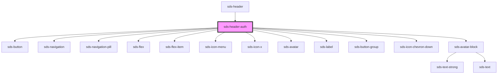

# sds-header-auth

<!-- Auto Generated Below -->

## Dependencies

### Used by

 - [sds-header](../sds-header)

### Depends on

- [sds-button](../../../primitives/Button/sds-button)
- [sds-navigation](../../../primitives/Navigation/sds-navigation)
- [sds-navigation-pill](../../../primitives/Navigation/sds-navigation-pill)
- [sds-flex](../../../layout/sds-flex)
- [sds-flex-item](../../../layout/sds-flex-item)
- [sds-icon-menu](../../../icons)
- [sds-icon-x](../../../icons)
- [sds-avatar](../../../primitives/Avatar/sds-avatar)
- [sds-label](../../../primitives/fieldset/sds-label)
- [sds-button-group](../../../primitives/Button/sds-button-group)
- [sds-icon-chevron-down](../../../icons)
- [sds-avatar-block](../../../primitives/Avatar/sds-avatar-block)

### Graph

----------------------------------------------

*Built with [StencilJS](https://stenciljs.com/)*
