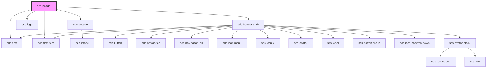

# sds-header

<!-- Auto Generated Below -->

## Dependencies

### Depends on

- [sds-section](../../../layout/sds-section)
- [sds-flex](../../../layout/sds-flex)
- [sds-flex-item](../../../layout/sds-flex-item)
- [sds-logo](../../../primitives/SdsLogo)
- [sds-header-auth](../sds-header-auth)

### Graph

----------------------------------------------

*Built with [StencilJS](https://stenciljs.com/)*
