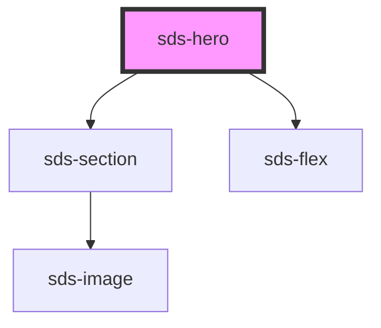

# sds-heroes

<!-- Auto Generated Below -->

## Properties

| Property         | Attribute         | Description                                                                                | Type                                                                     | Default     |
| ---------------- | ----------------- | ------------------------------------------------------------------------------------------ | ------------------------------------------------------------------------ | ----------- |
| `alignPrimary`   | `align-primary`   | Primary alignment                                                                          | `"center" \| "end" \| "space-between" \| "start" \| "stretch"`           | `'center'`  |
| `alignSecondary` | `align-secondary` | Secondary alignment                                                                        | `"center" \| "end" \| "space-between" \| "start" \| "stretch"`           | `'center'`  |
| `container`      | `container`       | Container                                                                                  | `boolean`                                                                | `true`      |
| `direction`      | `direction`       | Flex direction                                                                             | `"column" \| "column-reverse" \| "row" \| "row-reverse"`                 | `'column'`  |
| `elementType`    | `element-type`    | Type for the main section element                                                          | `"footer" \| "header" \| "section"`                                      | `'section'` |
| `flexType`       | `flex-type`       | Type                                                                                       | `"auto" \| "half" \| "quarter" \| "third"`                               | `'auto'`    |
| `gap`            | `gap`             | Gap                                                                                        | `"100" \| "1200" \| "1600" \| "200" \| "300" \| "400" \| "600" \| "800"` | `'600'`     |
| `padding`        | `padding`         | Padding for both top and bottom                                                            | `"1200" \| "1600" \| "4000" \| "600" \| "800"`                           | `'1600'`    |
| `paddingBottom`  | `padding-bottom`  | Overrides padding for the bottom of the section                                            | `"1200" \| "1600" \| "4000" \| "600" \| "800" \| null`                   | `null`      |
| `paddingTop`     | `padding-top`     | Overrides padding for the top of the section                                               | `"1200" \| "1600" \| "4000" \| "600" \| "800" \| null`                   | `null`      |
| `src`            | `src`             | Source string for the optional background image, variant must be set to 'image' to display | `string`                                                                 | `''`        |
| `variant`        | `variant`         | Visual variant of the section                                                              | `"brand" \| "image" \| "neutral" \| "stroke" \| "subtle"`                | `'subtle'`  |
| `wrap`           | `wrap`            | Wrap                                                                                       | `boolean`                                                                | `false`     |

## Dependencies

### Depends on

- [sds-section](../../../layout/sds-section)
- [sds-flex](../../../layout/sds-flex)

### Graph

----------------------------------------------

*Built with [StencilJS](https://stenciljs.com/)*
