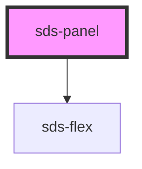

# sds-panel

<!-- Auto Generated Below -->

## Properties

| Property         | Attribute         | Description         | Type                                                                                  | Default     |
| ---------------- | ----------------- | ------------------- | ------------------------------------------------------------------------------------- | ----------- |
| `alignPrimary`   | `align-primary`   | Primary alignment   | `"center" \| "end" \| "space-between" \| "start" \| "stretch"`                        | `'start'`   |
| `alignSecondary` | `align-secondary` | Secondary alignment | `"center" \| "end" \| "space-between" \| "start" \| "stretch"`                        | `'start'`   |
| `direction`      | `direction`       | Flex direction      | `"column" \| "column-reverse" \| "row" \| "row-reverse"`                              | `'row'`     |
| `flexType`       | `flex-type`       | Type                | `"auto" \| "half" \| "quarter" \| "third"`                                            | `'auto'`    |
| `gap`            | `gap`             | Gap                 | `"100" \| "1200" \| "1600" \| "200" \| "300" \| "400" \| "600" \| "800" \| undefined` | `undefined` |

## Dependencies

### Depends on

- [sds-flex](../../../layout/sds-flex)

### Graph

----------------------------------------------

*Built with [StencilJS](https://stenciljs.com/)*
