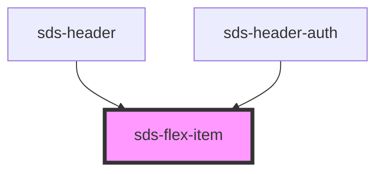

# sds-flex-item

<!-- Auto Generated Below -->

## Properties

| Property | Attribute | Description | Type                                                            | Default     |
| -------- | --------- | ----------- | --------------------------------------------------------------- | ----------- |
| `size`   | `size`    |             | `"fill" \| "full" \| "half" \| "major" \| "minor" \| undefined` | `undefined` |

## Dependencies

### Used by

 - [sds-header](../../compositions/Headers/sds-header)
 - [sds-header-auth](../../compositions/Headers/sds-header-auth)

### Graph

----------------------------------------------

*Built with [StencilJS](https://stenciljs.com/)*
