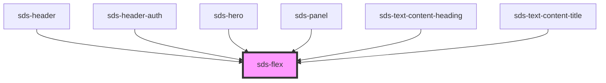

# sds-flex

<!-- Auto Generated Below -->

## Properties

| Property         | Attribute         | Description         | Type                                                                                  | Default     |
| ---------------- | ----------------- | ------------------- | ------------------------------------------------------------------------------------- | ----------- |
| `alignPrimary`   | `align-primary`   | Primary alignment   | `"center" \| "end" \| "space-between" \| "start" \| "stretch"`                        | `'start'`   |
| `alignSecondary` | `align-secondary` | Secondary alignment | `"center" \| "end" \| "space-between" \| "start" \| "stretch"`                        | `'start'`   |
| `container`      | `container`       | Container           | `boolean`                                                                             | `false`     |
| `direction`      | `direction`       | Flex direction      | `"column" \| "column-reverse" \| "row" \| "row-reverse"`                              | `'row'`     |
| `flexType`       | `flex-type`       | Type                | `"auto" \| "half" \| "quarter" \| "third"`                                            | `'auto'`    |
| `gap`            | `gap`             | Gap                 | `"100" \| "1200" \| "1600" \| "200" \| "300" \| "400" \| "600" \| "800" \| undefined` | `undefined` |
| `wrap`           | `wrap`            | Wrap                | `boolean`                                                                             | `false`     |

## Dependencies

### Used by

- [sds-header](../../compositions/Headers/sds-header)
- [sds-header-auth](../../compositions/Headers/sds-header-auth)
- [sds-hero](../../compositions/Sections/sds-heroes)
- [sds-panel](../../compositions/Sections/sds-panel)
- [sds-text-content-heading](../../primitives/Text/sds-text-content-heading)
- [sds-text-content-title](../../primitives/Text/sds-text-content-title)

### Graph

---

_Built with [StencilJS](https://stenciljs.com/)_
