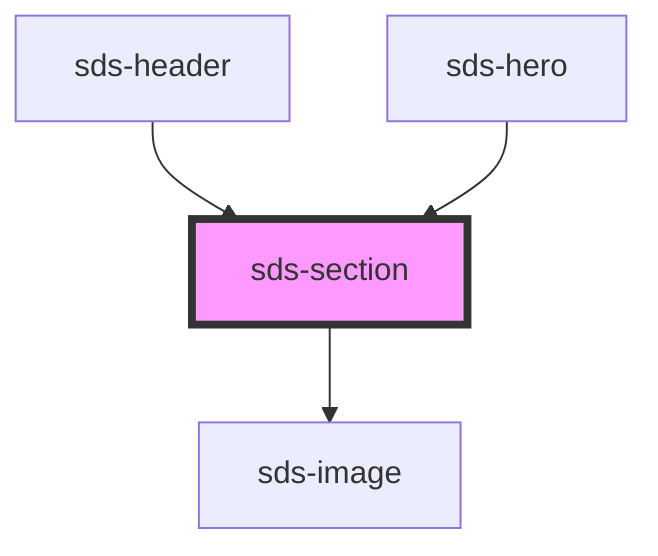

# sds-section

<!-- Auto Generated Below -->

## Properties

| Property        | Attribute        | Description                                                                                | Type                                                      | Default     |
| --------------- | ---------------- | ------------------------------------------------------------------------------------------ | --------------------------------------------------------- | ----------- |
| `elementType`   | `element-type`   | Type for the main section element                                                          | `"footer" \| "header" \| "section"`                       | `'section'` |
| `padding`       | `padding`        | Padding for both top and bottom                                                            | `"1200" \| "1600" \| "4000" \| "600" \| "800"`            | `'600'`     |
| `paddingBottom` | `padding-bottom` | Overrides padding for the bottom of the section                                            | `"1200" \| "1600" \| "4000" \| "600" \| "800" \| null`    | `null`      |
| `paddingTop`    | `padding-top`    | Overrides padding for the top of the section                                               | `"1200" \| "1600" \| "4000" \| "600" \| "800" \| null`    | `null`      |
| `src`           | `src`            | Source string for the optional background image, variant must be set to 'image' to display | `string`                                                  | `''`        |
| `variant`       | `variant`        | Visual variant of the section                                                              | `"brand" \| "image" \| "neutral" \| "stroke" \| "subtle"` | `'subtle'`  |

## Dependencies

### Used by

- [sds-header](../../compositions/Headers/sds-header)
- [sds-hero](../../compositions/Sections/sds-heroes)

### Depends on

- [sds-image](../../primitives/Image/sds-image)

### Graph

---

_Built with [StencilJS](https://stenciljs.com/)_
