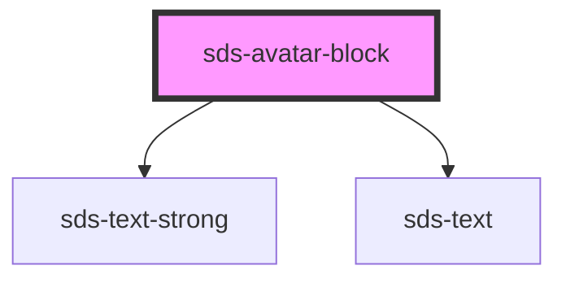

# sds-avatar-block

<!-- Auto Generated Below -->

## Properties

| Property                   | Attribute      | Description                                | Type     | Default     |
| -------------------------- | -------------- | ------------------------------------------ | -------- | ----------- |
| `avatarTitle` _(required)_ | `avatar-title` | The main text to the right of the avatar   | `string` | `undefined` |
| `description`              | `description`  | A small blurb that appears below the title | `string` | `''`        |

## Dependencies

### Depends on

- [sds-text-strong](../../Text/sds-text-strong)
- [sds-text](../../Text/sds-text)

### Graph

----------------------------------------------

*Built with [StencilJS](https://stenciljs.com/)*
