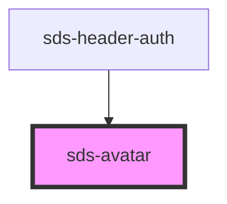

# sds-avatar

<!-- Auto Generated Below -->

## Properties

| Property   | Attribute  | Description                                           | Type                             | Default    |
| ---------- | ---------- | ----------------------------------------------------- | -------------------------------- | ---------- |
| `alt`      | `alt`      | Alt text for the image                                | `string`                         | `''`       |
| `initials` | `initials` | Initials that will appear behind/instead of the image | `string`                         | `''`       |
| `size`     | `size`     | The size of the avatar                                | `"large" \| "medium" \| "small"` | `'medium'` |
| `square`   | `square`   | Sets the avatar to be square, rather than round       | `boolean`                        | `false`    |
| `src`      | `src`      | URL for the avatar's image source                     | `string`                         | `''`       |

## Dependencies

### Used by

 - [sds-header-auth](../../../compositions/Headers/sds-header-auth)

### Graph

----------------------------------------------

*Built with [StencilJS](https://stenciljs.com/)*
