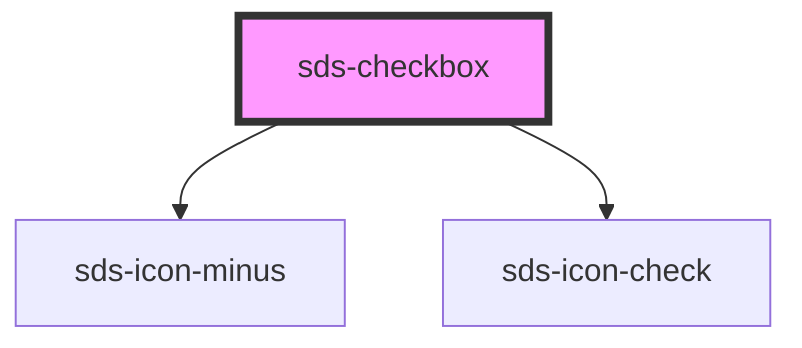

# sds-checkbox

<!-- Auto Generated Below -->

## Properties

| Property        | Attribute       | Description                                | Type      | Default |
| --------------- | --------------- | ------------------------------------------ | --------- | ------- |
| `disabled`      | `disabled`      | Disables the checkbox                      | `boolean` | `false` |
| `indeterminate` | `indeterminate` | Marks the checkbox as an in-between state  | `boolean` | `false` |
| `selected`      | `selected`      | Controls if the checkbox is checked or not | `boolean` | `false` |
| `value`         | `value`         | The value of the checkbox                  | `string`  | `''`    |

## Events

| Event        | Description                          | Type                                                |
| ------------ | ------------------------------------ | --------------------------------------------------- |
| `sds-change` | Emitted when the checkbox is toggled | `CustomEvent<{ checked: boolean; value: string; }>` |

## Dependencies

### Depends on

- [sds-icon-minus](../../../icons)
- [sds-icon-check](../../../icons)

### Graph

----------------------------------------------

*Built with [StencilJS](https://stenciljs.com/)*
