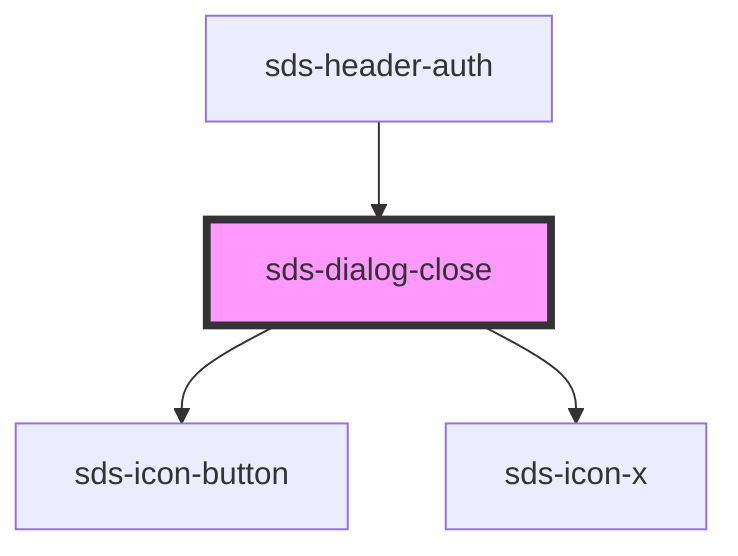

# sds-dialog-close

<!-- Auto Generated Below -->

## Events

| Event              | Description                              | Type               |
| ------------------ | ---------------------------------------- | ------------------ |
| `sds-close-dialog` | Emitted when the close-button is clicked | `CustomEvent<any>` |

## Dependencies

### Used by

 - [sds-header-auth](../../../compositions/Headers/sds-header-auth)

### Depends on

- [sds-icon-button](../../button/sds-icon-button)
- [sds-icon-x](../../../icons)

### Graph

----------------------------------------------

*Built with [StencilJS](https://stenciljs.com/)*
