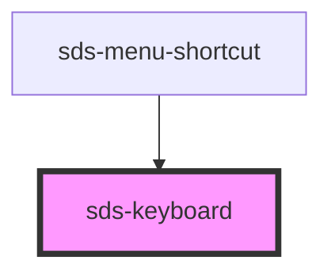

# sds-keyboard

<!-- Auto Generated Below -->

## Overview

Fieldset Keyboard

## Dependencies

### Used by

 - [sds-menu-shortcut](../../Menu/sds-menu-shortcut)

### Graph

----------------------------------------------

*Built with [StencilJS](https://stenciljs.com/)*
