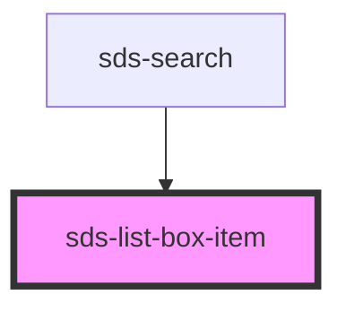

# sds-list-box-item

<!-- Auto Generated Below -->

## Properties

| Property   | Attribute  | Description                    | Type                     | Default    |
| ---------- | ---------- | ------------------------------ | ------------------------ | ---------- |
| `checked`  | `checked`  | Render checkbox or normal item | `boolean`                | `false`    |
| `disabled` | `disabled` | Disable option                 | `boolean`                | `false`    |
| `loading`  | `loading`  | Display loading state          | `boolean`                | `false`    |
| `type`     | `type`     | Render checkbox or normal item | `"checkbox" \| "normal"` | `'normal'` |
| `value`    | `value`    | Unique value for item          | `string`                 | `''`       |

## Methods

### `deselect() => Promise<void>`

#### Returns

Type: `Promise<void>`

## Dependencies

### Used by

 - [sds-search](../../Search/sds-search)

### Graph

----------------------------------------------

*Built with [StencilJS](https://stenciljs.com/)*
