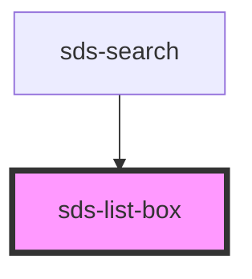

# sds-list-box

<!-- Auto Generated Below -->

## Properties

| Property      | Attribute     | Description                     | Type                         | Default      |
| ------------- | ------------- | ------------------------------- | ---------------------------- | ------------ |
| `layout`      | `layout`      | Layout for options              | `"grid" \| "stack"`          | `'stack'`    |
| `orientation` | `orientation` | Alignment direction for options | `"horizontal" \| "vertical"` | `'vertical'` |

## Events

| Event        | Description                                   | Type                                 |
| ------------ | --------------------------------------------- | ------------------------------------ |
| `sds-select` | Emitted when an sds-list-box-item is selected | `CustomEvent<{ item: SlMenuItem; }>` |

## Dependencies

### Used by

 - [sds-search](../../Search/sds-search)

### Graph

----------------------------------------------

*Built with [StencilJS](https://stenciljs.com/)*
