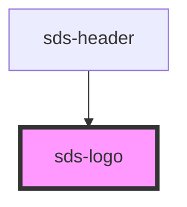

# sds-logo

<!-- Auto Generated Below -->

## Properties

| Property      | Attribute | Description                 | Type                                                                                            | Default     |
| ------------- | --------- | --------------------------- | ----------------------------------------------------------------------------------------------- | ----------- |
| `logoOptions` | --        | The props of AnchorOrButton | `ButtonProps & AnchorOrButtonSharedProps \| LinkProps & AnchorOrButtonSharedProps \| undefined` | `undefined` |

## Dependencies

### Used by

 - [sds-header](../../compositions/Headers/sds-header)

### Graph

----------------------------------------------

*Built with [StencilJS](https://stenciljs.com/)*
