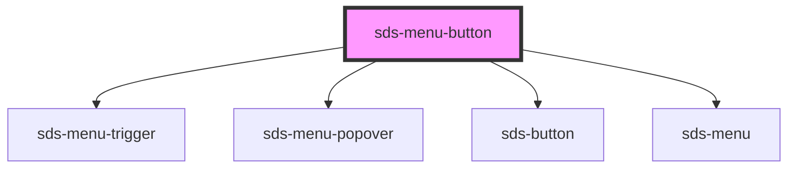

# sds-menu-button

<!-- Auto Generated Below -->

## Properties

| Property     | Attribute     | Description                                                    | Type                                                                                                                                                                 | Default          |
| ------------ | ------------- | -------------------------------------------------------------- | -------------------------------------------------------------------------------------------------------------------------------------------------------------------- | ---------------- |
| `isDisabled` | `is-disabled` | Disables the menu button                                       | `boolean`                                                                                                                                                            | `false`          |
| `label`      | `label`       | Label / Aria-label for the button                              | `string`                                                                                                                                                             | `''`             |
| `placement`  | `placement`   | Placement for where the menu appears in relation to the button | `"bottom" \| "bottom-end" \| "bottom-start" \| "left" \| "left-end" \| "left-start" \| "right" \| "right-end" \| "right-start" \| "top" \| "top-end" \| "top-start"` | `'bottom-start'` |
| `variant`    | `variant`     | Label Button variant                                           | `"neutral" \| "primary" \| "subtle"`                                                                                                                                 | `'primary'`      |

## Methods

### `closeMenu() => Promise<void>`

Closes the Menu

#### Returns

Type: `Promise<void>`

### `openMenu() => Promise<void>`

Opens the Menu

#### Returns

Type: `Promise<void>`

### `toggleMenu() => Promise<void>`

Toggles the menu open/closed

#### Returns

Type: `Promise<void>`

## Dependencies

### Depends on

- [sds-menu-trigger](../sds-menu-trigger)
- [sds-menu-popover](../sds-menu-popover)
- [sds-button](../../Button/sds-button)
- [sds-menu](../sds-menu)

### Graph

----------------------------------------------

*Built with [StencilJS](https://stenciljs.com/)*
