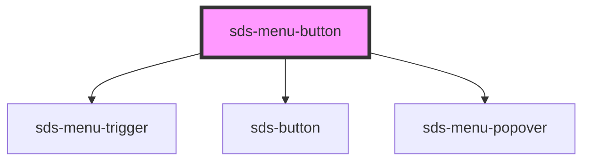

# sds-menu-button

<!-- Auto Generated Below -->

## Properties

| Property  | Attribute | Description                       | Type                                 | Default     |
| --------- | --------- | --------------------------------- | ------------------------------------ | ----------- |
| `label`   | `label`   | Label / Aria-label for the button | `string`                             | `''`        |
| `variant` | `variant` | Label Button variant              | `"neutral" \| "primary" \| "subtle"` | `'primary'` |

## Methods

### `closeMenu() => Promise<void>`

Closes the Menu

#### Returns

Type: `Promise<void>`

### `openMenu() => Promise<void>`

Opens the Menu

#### Returns

Type: `Promise<void>`

## Dependencies

### Depends on

- [sds-menu-trigger](../sds-menu-trigger)
- [sds-button](../../Button/sds-button)
- [sds-menu-popover](../sds-menu-popover)

### Graph

----------------------------------------------

*Built with [StencilJS](https://stenciljs.com/)*
