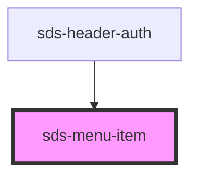

# sds-menu-item

<!-- Auto Generated Below -->

## Properties

| Property     | Attribute     | Description            | Type      | Default |
| ------------ | ------------- | ---------------------- | --------- | ------- |
| `isDisabled` | `is-disabled` | Disables the menu-item | `boolean` | `false` |

## Events

| Event         | Description                           | Type               |
| ------------- | ------------------------------------- | ------------------ |
| `sds-clicked` | Emitted when the menu item is clicked | `CustomEvent<any>` |

## Dependencies

### Used by

 - [sds-header-auth](../../../compositions/Headers/sds-header-auth)

### Graph

----------------------------------------------

*Built with [StencilJS](https://stenciljs.com/)*
