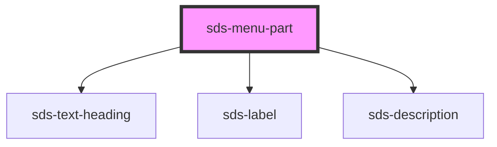

# sds-menu-part

<!-- Auto Generated Below -->

## Properties

| Property               | Attribute | Description              | Type                                                                            | Default     |
| ---------------------- | --------- | ------------------------ | ------------------------------------------------------------------------------- | ----------- |
| `variant` _(required)_ | `variant` | Type of Menu Part to use | `"description" \| "header" \| "heading" \| "label" \| "section" \| "separator"` | `undefined` |

## Dependencies

### Depends on

- [sds-text-heading](../../Text/sds-text-heading)
- [sds-label](../../fieldset/sds-label)
- [sds-description](../../fieldset/sds-description)

### Graph

----------------------------------------------

*Built with [StencilJS](https://stenciljs.com/)*
