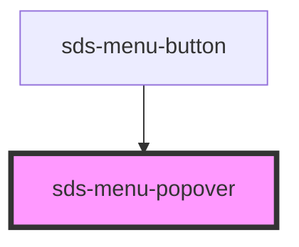

# sds-menu-popover

<!-- Auto Generated Below -->

## Properties

| Property    | Attribute   | Description | Type                                                                                                                                                                 | Default          |
| ----------- | ----------- | ----------- | -------------------------------------------------------------------------------------------------------------------------------------------------------------------- | ---------------- |
| `isOpen`    | `is-open`   |             | `boolean`                                                                                                                                                            | `false`          |
| `placement` | `placement` |             | `"bottom" \| "bottom-end" \| "bottom-start" \| "left" \| "left-end" \| "left-start" \| "right" \| "right-end" \| "right-start" \| "top" \| "top-end" \| "top-start"` | `'bottom-start'` |

## Dependencies

### Used by

 - [sds-menu-button](../sds-menu-button)

### Graph

----------------------------------------------

*Built with [StencilJS](https://stenciljs.com/)*
