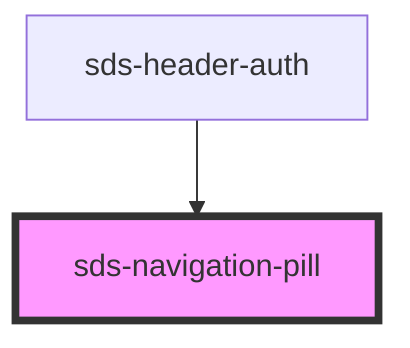

# sds-navigation-pill

<!-- Auto Generated Below -->

## Properties

| Property     | Attribute     | Description                       | Type                                                                                            | Default     |
| ------------ | ------------- | --------------------------------- | ----------------------------------------------------------------------------------------------- | ----------- |
| `isSelected` | `is-selected` | Denotes if the button is selected | `boolean`                                                                                       | `false`     |
| `options`    | --            | The props of AnchorOrButton       | `ButtonProps & AnchorOrButtonSharedProps \| LinkProps & AnchorOrButtonSharedProps \| undefined` | `undefined` |

## Events

| Event                     | Description                 | Type                      |
| ------------------------- | --------------------------- | ------------------------- |
| `sds-navigation-selected` | Event emitted when selected | `CustomEvent<MouseEvent>` |

## Dependencies

### Used by

 - [sds-header-auth](../../../compositions/Headers/sds-header-auth)

### Graph

----------------------------------------------

*Built with [StencilJS](https://stenciljs.com/)*
