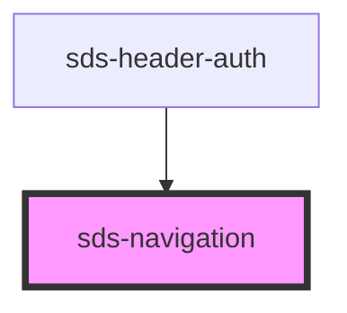

# sds-navigation

<!-- Auto Generated Below -->

## Properties

| Property    | Attribute   | Description                   | Type                | Default |
| ----------- | ----------- | ----------------------------- | ------------------- | ------- |
| `direction` | `direction` | Flex direction of the content | `"column" \| "row"` | `'row'` |

## Dependencies

### Used by

 - [sds-header-auth](../../../compositions/Headers/sds-header-auth)

### Graph

----------------------------------------------

*Built with [StencilJS](https://stenciljs.com/)*
