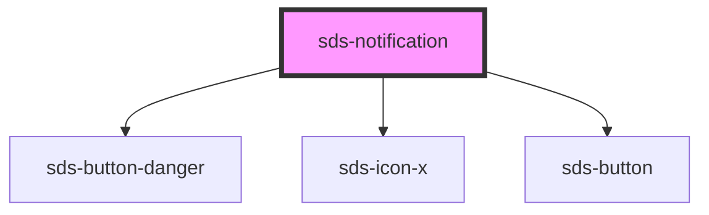

# sds-notification

<!-- Auto Generated Below -->

## Properties

| Property        | Attribute        | Description                             | Type                   | Default     |
| --------------- | ---------------- | --------------------------------------- | ---------------------- | ----------- |
| `isDismissible` | `is-dismissible` | Allows the notification to be dismissed | `boolean`              | `false`     |
| `variant`       | `variant`        | Visual variant of the alert             | `"alert" \| "message"` | `'message'` |

## Events

| Event         | Description                                | Type               |
| ------------- | ------------------------------------------ | ------------------ |
| `sds-dismiss` | Emitted when the notification is dismissed | `CustomEvent<any>` |

## Dependencies

### Depends on

- [sds-button-danger](../Button/sds-button-danger)
- [sds-icon-x](../../icons)
- [sds-button](../Button/sds-button)

### Graph

----------------------------------------------

*Built with [StencilJS](https://stenciljs.com/)*
