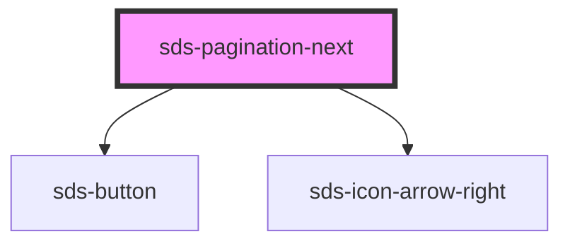

# sds-pagination-next

<!-- Auto Generated Below -->

## Properties

| Property | Attribute | Description                                                                                  | Type             | Default  |
| -------- | --------- | -------------------------------------------------------------------------------------------- | ---------------- | -------- |
| `href`   | `href`    | Link for the next page (currently WIP), disables the button if null                          | `null \| string` | `null`   |
| `label`  | `label`   | Label for the next page button, defaults to 'Next' and can be overridden via a child element | `string`         | `'Next'` |

## Dependencies

### Depends on

- [sds-button](../../button/sds-button)
- [sds-icon-arrow-right](../../../icons)

### Graph

----------------------------------------------

*Built with [StencilJS](https://stenciljs.com/)*
