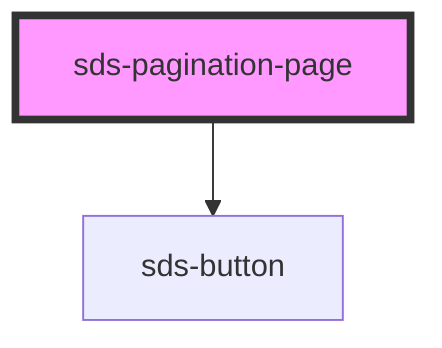

# sds-pagination-page

<!-- Auto Generated Below -->

## Properties

| Property                  | Attribute     | Description                                                        | Type      | Default     |
| ------------------------- | ------------- | ------------------------------------------------------------------ | --------- | ----------- |
| `current`                 | `current`     | Visually and via `aria-current` marks this page as the current one | `boolean` | `false`     |
| `href`                    | `href`        | Link for the button                                                | `string`  | `''`        |
| `pageNumber` _(required)_ | `page-number` | The page number this links to                                      | `number`  | `undefined` |

## Dependencies

### Depends on

- [sds-button](../../button/sds-button)

### Graph

----------------------------------------------

*Built with [StencilJS](https://stenciljs.com/)*
