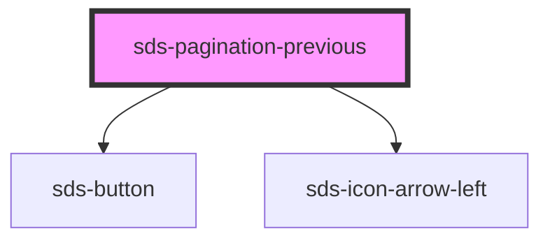

# sds-pagination-previous

<!-- Auto Generated Below -->

## Properties

| Property   | Attribute  | Description                                                                                      | Type      | Default      |
| ---------- | ---------- | ------------------------------------------------------------------------------------------------ | --------- | ------------ |
| `disabled` | `disabled` | Disables this nav button                                                                         | `boolean` | `false`      |
| `label`    | `label`    | Label for the next page button, defaults to 'Previous' and can be overridden via a child element | `string`  | `'Previous'` |

## Dependencies

### Depends on

- [sds-button](../../Button/sds-button)
- [sds-icon-arrow-left](../../../icons)

### Graph

----------------------------------------------

*Built with [StencilJS](https://stenciljs.com/)*
