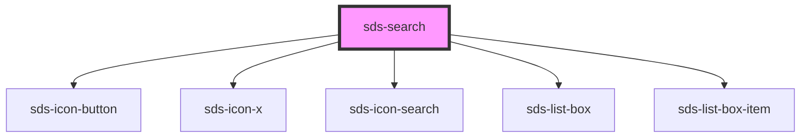

# sds-search

<!-- Auto Generated Below -->

## Properties

| Property      | Attribute     | Description                         | Type                    | Default     |
| ------------- | ------------- | ----------------------------------- | ----------------------- | ----------- |
| `ariaLabel`   | `aria-label`  | Label for the search input (hidden) | `string`                | `'Search'`  |
| `disabled`    | `disabled`    | Disables the search                 | `boolean`               | `false`     |
| `placeholder` | `placeholder` | Placeholder text for the search     | `string`                | `''`        |
| `results`     | --            | Results to be shown below input     | `string[] \| undefined` | `undefined` |

## Events

| Event        | Description                       | Type                                   |
| ------------ | --------------------------------- | -------------------------------------- |
| `sds-search` | Emitted when search input changes | `CustomEvent<{ searchTerm: string; }>` |

## Dependencies

### Depends on

- [sds-icon-button](../../Button/sds-icon-button)
- [sds-icon-x](../../../icons)
- [sds-icon-search](../../../icons)
- [sds-list-box](../../ListBox/sds-list-box)
- [sds-list-box-item](../../ListBox/sds-list-box-item)

### Graph

----------------------------------------------

*Built with [StencilJS](https://stenciljs.com/)*
