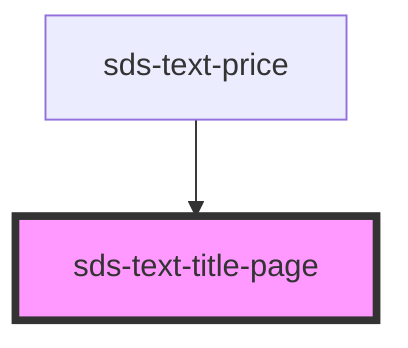

# sds-text

<!-- Auto Generated Below -->

## Properties

| Property      | Attribute      | Description  | Type     | Default |
| ------------- | -------------- | ------------ | -------- | ------- |
| `elementType` | `element-type` | Element type | `string` | `'h2'`  |

## Dependencies

### Used by

- [sds-text-price](.)

### Graph

---

_Built with [StencilJS](https://stenciljs.com/)_
