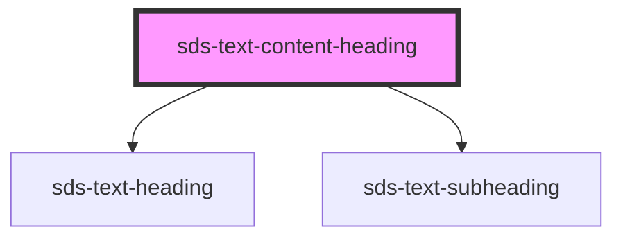

# sds-text-content-heading

<!-- Auto Generated Below -->

## Properties

| Property     | Attribute     | Description    | Type                  | Default   |
| ------------ | ------------- | -------------- | --------------------- | --------- |
| `align`      | `align`       | Align position | `"center" \| "start"` | `'start'` |
| `heading`    | `heading`     | Heading        | `string`              | `''`      |
| `subHeading` | `sub-heading` | Sub Heading    | `string`              | `''`      |

## Dependencies

### Depends on

- [sds-text-heading](../sds-text-heading)
- [sds-text-subheading](../sds-text-subheading)

### Graph

----------------------------------------------

*Built with [StencilJS](https://stenciljs.com/)*
