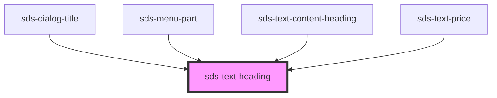

# sds-text-heading

<!-- Auto Generated Below -->

## Properties

| Property      | Attribute      | Description  | Type                                                                                   | Default |
| ------------- | -------------- | ------------ | -------------------------------------------------------------------------------------- | ------- |
| `elementType` | `element-type` | Element type | `"h1" \| "h2" \| "h3" \| "h4" \| "h5" \| "h6" \| "p" \| "small" \| "span" \| "strong"` | `'h3'`  |

## Dependencies

### Used by

 - [sds-dialog-title](../../dialog/sds-dialog-title)
 - [sds-menu-part](../../Menu/sds-menu-part)
 - [sds-text-content-heading](../sds-text-content-heading)
 - [sds-text-price](../sds-text-price)

### Graph

----------------------------------------------

*Built with [StencilJS](https://stenciljs.com/)*
