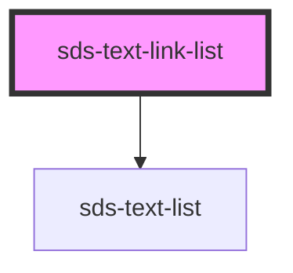

# sds-text-link-list

<!-- Auto Generated Below -->

## Properties

| Property    | Attribute | Description | Type                   | Default     |
| ----------- | --------- | ----------- | ---------------------- | ----------- |
| `density`   | `density` | Density     | `"default" \| "tight"` | `'default'` |
| `titleElem` | --        | title       | `VNode \| undefined`   | `undefined` |

## Dependencies

### Depends on

- [sds-text-list](../sds-text-list)

### Graph

----------------------------------------------

*Built with [StencilJS](https://stenciljs.com/)*
