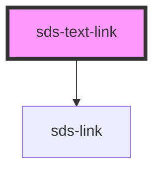

# sds-text-link

<!-- Auto Generated Below -->

## Properties

| Property   | Attribute  | Description                                                            | Type                                        | Default     |
| ---------- | ---------- | ---------------------------------------------------------------------- | ------------------------------------------- | ----------- |
| `download` | `download` | Download HTML attribute                                                | `string \| undefined`                       | `undefined` |
| `href`     | `href`     | Href of the link                                                       | `string \| undefined`                       | `undefined` |
| `hreflang` | `hreflang` | HrefLang HTML attribute to specify the language of the linked document | `string \| undefined`                       | `undefined` |
| `media`    | `media`    | Media HTML attribute                                                   | `string \| undefined`                       | `undefined` |
| `ping`     | `ping`     | Ping HTML attribute                                                    | `string \| undefined`                       | `undefined` |
| `rel`      | `rel`      | Rel HTML attribute                                                     | `string \| undefined`                       | `undefined` |
| `target`   | `target`   | Target of the link                                                     | `"_blank" \| "_self" \| "_top" \| "parent"` | `'_self'`   |

## Dependencies

### Depends on

- [sds-link](../../sds-link)

### Graph

----------------------------------------------

*Built with [StencilJS](https://stenciljs.com/)*
