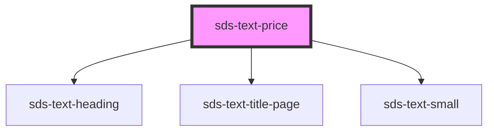

# sds-text-price

<!-- Auto Generated Below -->

## Properties

| Property      | Attribute      | Description  | Type                  | Default     |
| ------------- | -------------- | ------------ | --------------------- | ----------- |
| `currency`    | `currency`     | Currency     | `string`              | `''`        |
| `elementType` | `element-type` | Element type | `string`              | `'p'`       |
| `label`       | `label`        | Label        | `string \| undefined` | `undefined` |
| `price`       | `price`        | Price        | `string`              | `''`        |
| `size`        | `size`         | Size of text | `"large" \| "small"`  | `'large'`   |

## Dependencies

### Depends on

- [sds-text-heading](../sds-text-heading)
- [sds-text-title-page](../sds-text-title-page)
- [sds-text-small](../sds-text-small)

### Graph

----------------------------------------------

*Built with [StencilJS](https://stenciljs.com/)*
