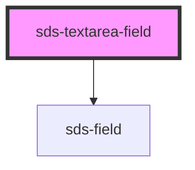

# sds-textarea-field

<!-- Auto Generated Below -->

## Properties

| Property      | Attribute     | Description                                      | Type                                        | Default     |
| ------------- | ------------- | ------------------------------------------------ | ------------------------------------------- | ----------- |
| `description` | `description` | A secondary label below the textarea             | `string`                                    | `''`        |
| `disabled`    | `disabled`    | Disables the textarea                            | `boolean`                                   | `false`     |
| `error`       | `error`       | An error message that appears below the textarea | `string`                                    | `''`        |
| `label`       | `label`       | The textarea label                               | `string`                                    | `''`        |
| `placeholder` | `placeholder` | Placeholder text for the textarea                | `string`                                    | `''`        |
| `required`    | `required`    | Marks the textarea as required                   | `boolean`                                   | `false`     |
| `resizable`   | `resizable`   | Allows the textarea to be resized                | `boolean`                                   | `true`      |
| `value`       | `value`       | Value for the textarea                           | `number \| string \| string[] \| undefined` | `undefined` |

## Events

| Event        | Description                                  | Type                              |
| ------------ | -------------------------------------------- | --------------------------------- |
| `sds-change` | Emitted when the textarea's value is changed | `CustomEvent<{ value: string; }>` |
| `sds-input`  | Emitted when the textarea's has input        | `CustomEvent<{ value: string; }>` |

## Dependencies

### Depends on

- [sds-field](../../fieldset/sds-field)

### Graph

----------------------------------------------

*Built with [StencilJS](https://stenciljs.com/)*
