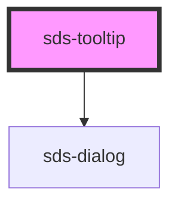

# sds-tooltip

<!-- Auto Generated Below -->

## Overview

Tooltip

## Properties

| Property    | Attribute   | Description                                                       | Type                                                                                                                                                                 | Default    |
| ----------- | ----------- | ----------------------------------------------------------------- | -------------------------------------------------------------------------------------------------------------------------------------------------------------------- | ---------- |
| `isActive`  | `is-active` | Controls if the tooltip is visible or not                         | `boolean`                                                                                                                                                            | `false`    |
| `offset`    | `offset`    | Distance of the tooltip from the anchor                           | `number`                                                                                                                                                             | `16`       |
| `placement` | `placement` | Placement for where the tooltip appears in relation to the anchor | `"bottom" \| "bottom-end" \| "bottom-start" \| "left" \| "left-end" \| "left-start" \| "right" \| "right-end" \| "right-start" \| "top" \| "top-end" \| "top-start"` | `'bottom'` |

## Methods

### `toggleTooltip() => Promise<void>`

Will programmatically toggle the visibility of the tooltip

#### Returns

Type: `Promise<void>`

## Slots

| Slot       | Description                                                      |
| ---------- | ---------------------------------------------------------------- |
|            | slot for the dialog content                                      |
| `"anchor"` | slot for the element that, when clicked, will toggle the tooltip |

## Dependencies

### Depends on

- [sds-dialog](../../Dialog/sds-dialog)

### Graph

----------------------------------------------

*Built with [StencilJS](https://stenciljs.com/)*
