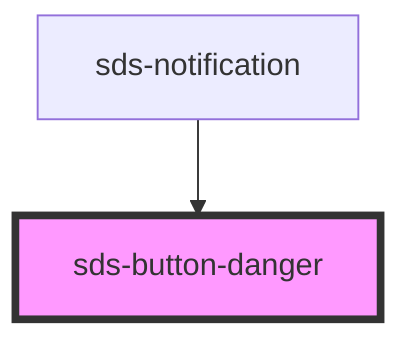

# sds-button-danger

<!-- Auto Generated Below -->

## Properties

| Property   | Attribute  | Description               | Type                                               | Default            |
| ---------- | ---------- | ------------------------- | -------------------------------------------------- | ------------------ |
| `disabled` | `disabled` | Disables the button       | `boolean \| undefined`                             | `undefined`        |
| `size`     | `size`     | The button size           | `"medium" \| "small" \| undefined`                 | `undefined`        |
| `type`     | `type`     | The button type           | `"button" \| "reset" \| "submit" \| undefined`     | `undefined`        |
| `variant`  | `variant`  | The button danger variant | `"danger-primary" \| "danger-subtle" \| undefined` | `'danger-primary'` |

## Dependencies

### Used by

 - [sds-notification](../../Notification)

### Graph

----------------------------------------------

*Built with [StencilJS](https://stenciljs.com/)*
