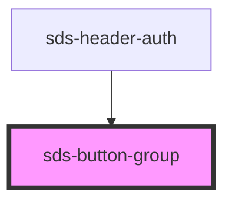

# sds-button-group

<!-- Auto Generated Below -->

## Properties

| Property | Attribute | Description | Type                                                                | Default   |
| -------- | --------- | ----------- | ------------------------------------------------------------------- | --------- |
| `align`  | `align`   |             | `"center" \| "end" \| "justify" \| "stack" \| "start" \| undefined` | `'start'` |

## Dependencies

### Used by

 - [sds-header-auth](../../../compositions/Headers/sds-header-auth)

### Graph

----------------------------------------------

*Built with [StencilJS](https://stenciljs.com/)*
