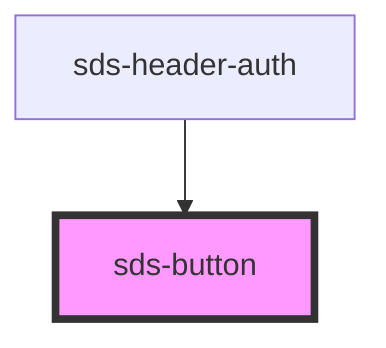

# sds-button-group

<!-- Auto Generated Below -->

## Properties

| Property   | Attribute  | Description                | Type                                 | Default     |
| ---------- | ---------- | -------------------------- | ------------------------------------ | ----------- |
| `disabled` | `disabled` | Disables the button        | `boolean \| undefined`               | `undefined` |
| `size`     | `size`     | The button size            | `"medium" \| "small"`                | `'medium'`  |
| `type`     | `type`     | The button type            | `"button" \| "reset" \| "submit"`    | `'button'`  |
| `variant`  | `variant`  | The button default variant | `"neutral" \| "primary" \| "subtle"` | `'primary'` |

## Dependencies

### Used by

 - [sds-header-auth](../../../compositions/Headers/sds-header-auth)

### Graph

----------------------------------------------

*Built with [StencilJS](https://stenciljs.com/)*
