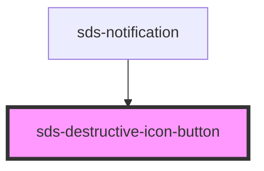

# sds-destructive-icon-button

<!-- Auto Generated Below -->

## Properties

| Property                 | Attribute    | Description                | Type                                  | Default            |
| ------------------------ | ------------ | -------------------------- | ------------------------------------- | ------------------ |
| `ariaLabel` _(required)_ | `aria-label` | Aria Label for the button  | `string`                              | `undefined`        |
| `disabled`               | `disabled`   | Disables the button        | `boolean`                             | `false`            |
| `size`                   | `size`       | The button size            | `"medium" \| "small"`                 | `'medium'`         |
| `type`                   | `type`       | The button type            | `"button" \| "reset" \| "submit"`     | `'button'`         |
| `variant`                | `variant`    | The button default variant | `"danger-primary" \| "danger-subtle"` | `'danger-primary'` |

## Dependencies

### Used by

 - [sds-notification](../../Notification)

### Graph

----------------------------------------------

*Built with [StencilJS](https://stenciljs.com/)*
