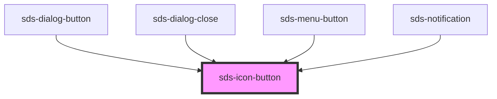

# sds-icon-button

<!-- Auto Generated Below -->

## Properties

| Property                 | Attribute    | Description                | Type                                 | Default     |
| ------------------------ | ------------ | -------------------------- | ------------------------------------ | ----------- |
| `ariaLabel` _(required)_ | `aria-label` | Aria Label for the button  | `string`                             | `undefined` |
| `disabled`               | `disabled`   | Disables the button        | `boolean`                            | `false`     |
| `size`                   | `size`       | The button size            | `"medium" \| "small"`                | `'medium'`  |
| `type`                   | `type`       | The button type            | `"button" \| "reset" \| "submit"`    | `'button'`  |
| `variant`                | `variant`    | The button default variant | `"neutral" \| "primary" \| "subtle"` | `'primary'` |

## Dependencies

### Used by

 - [sds-dialog-button](../../Dialog/sds-dialog-button)
 - [sds-dialog-close](../../Dialog/sds-dialog-close)
 - [sds-menu-button](../../Menu/sds-menu-button)
 - [sds-notification](../../Notification)

### Graph

----------------------------------------------

*Built with [StencilJS](https://stenciljs.com/)*
