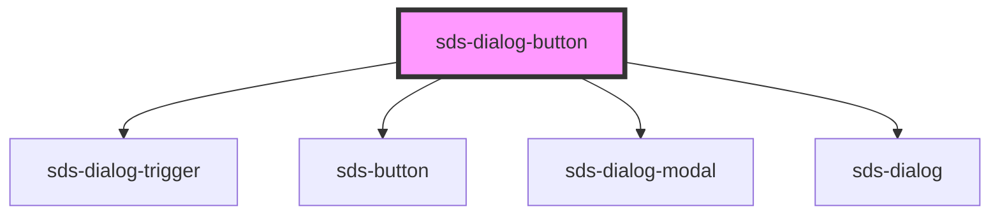

# sds-dialog-button

<!-- Auto Generated Below -->

## Properties

| Property  | Attribute  | Description | Type                                 | Default     |
| --------- | ---------- | ----------- | ------------------------------------ | ----------- |
| `label`   | `label`    |             | `string`                             | `''`        |
| `useIcon` | `use-icon` |             | `boolean`                            | `false`     |
| `variant` | `variant`  |             | `"neutral" \| "primary" \| "subtle"` | `'primary'` |

## Dependencies

### Depends on

- [sds-dialog-trigger](../sds-dialog-trigger)
- [sds-button](../../Button/sds-button)
- [sds-dialog-modal](../sds-dialog-modal)
- [sds-dialog](../sds-dialog)

### Graph

----------------------------------------------

*Built with [StencilJS](https://stenciljs.com/)*
