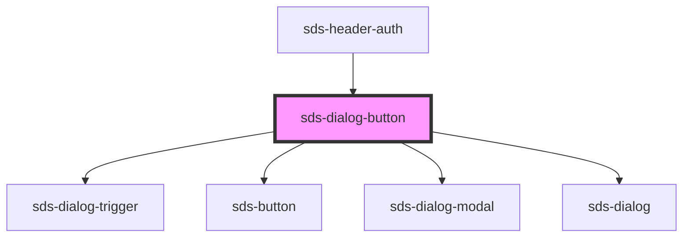

# sds-dialog-button

<!-- Auto Generated Below -->

## Properties

| Property  | Attribute  | Description                                                      | Type                                 | Default     |
| --------- | ---------- | ---------------------------------------------------------------- | ------------------------------------ | ----------- |
| `label`   | `label`    | Label / Aria-label for the button                                | `string`                             | `''`        |
| `useIcon` | `use-icon` | Controls if the icon-button should be used over the label button | `boolean`                            | `false`     |
| `variant` | `variant`  | Label Button variant                                             | `"neutral" \| "primary" \| "subtle"` | `'primary'` |

## Methods

### `closeDialog() => Promise<void>`

Closes the dialog

#### Returns

Type: `Promise<void>`

### `openDialog() => Promise<void>`

Opens the dialog

#### Returns

Type: `Promise<void>`

## Dependencies

### Used by

 - [sds-header-auth](../../../compositions/Headers/sds-header-auth)

### Depends on

- [sds-dialog-trigger](../sds-dialog-trigger)
- [sds-button](../../Button/sds-button)
- [sds-dialog-modal](../sds-dialog-modal)
- [sds-dialog](../sds-dialog)

### Graph

----------------------------------------------

*Built with [StencilJS](https://stenciljs.com/)*
