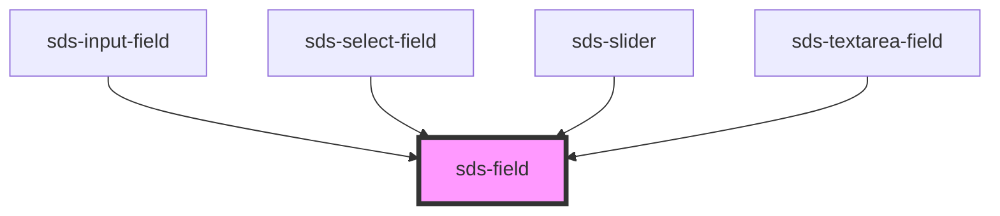

# sds-field

<!-- Auto Generated Below -->

## Overview

Fieldset Field

## Properties

| Property   | Attribute  | Description                              | Type      | Default |
| ---------- | ---------- | ---------------------------------------- | --------- | ------- |
| `disabled` | `disabled` | Controls if the field is disabled or not | `boolean` | `false` |

## Dependencies

### Used by

 - [sds-input-field](../../Input/sds-input-field)
 - [sds-select-field](../../Select/sds-select-field)
 - [sds-slider](../../Slider)
 - [sds-textarea-field](../../Textarea/sds-textarea-field)

### Graph

----------------------------------------------

*Built with [StencilJS](https://stenciljs.com/)*
