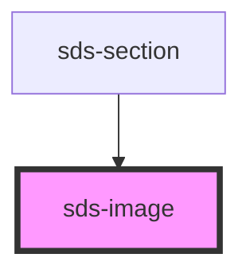

# sds-image

<!-- Auto Generated Below -->

## Properties

| Property           | Attribute      | Description                | Type                                                    | Default     |
| ------------------ | -------------- | -------------------------- | ------------------------------------------------------- | ----------- |
| `alt` _(required)_ | `alt`          | Alt description            | `string`                                                | `undefined` |
| `aspectRatio`      | `aspect-ratio` | Aspect Ratio               | `"1-1" \| "16-9" \| "4-3" \| "fill" \| "natural"`       | `'natural'` |
| `crossorigin`      | `crossorigin`  | Crossorigin html attribute | `"" \| "anonymous" \| "use-credentials" \| undefined`   | `undefined` |
| `decoding`         | `decoding`     | Decoding html attribute    | `"async" \| "auto" \| "sync" \| undefined`              | `'auto'`    |
| `height`           | `height`       | Height html attribute      | `number \| string \| undefined`                         | `undefined` |
| `loading`          | `loading`      | Loading html attribute     | `"eager" \| "lazy" \| undefined`                        | `'eager'`   |
| `size`             | `size`         | Size                       | `"fill" \| "large" \| "medium" \| "natural" \| "small"` | `'natural'` |
| `sizes`            | `sizes`        | Sizes html attribute       | `string \| undefined`                                   | `undefined` |
| `src`              | `src`          | The src url                | `string \| undefined`                                   | `undefined` |
| `srcset`           | `srcset`       | SrcSet url html attribute  | `string \| undefined`                                   | `undefined` |
| `usemap`           | `usemap`       | Usemap html attribute      | `string \| undefined`                                   | `undefined` |
| `variant`          | `variant`      | The variant                | `"default" \| "rounded"`                                | `'rounded'` |
| `width`            | `width`        | Width html attribute       | `number \| string \| undefined`                         | `undefined` |

## Dependencies

### Used by

 - [sds-section](../../../layout/sds-section)

### Graph

----------------------------------------------

*Built with [StencilJS](https://stenciljs.com/)*
