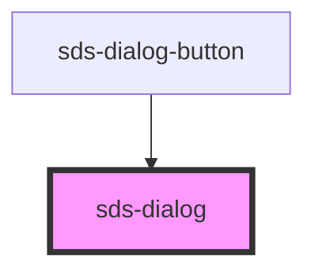

# sds-dialog

<!-- Auto Generated Below -->

## Properties

| Property     | Attribute     | Description | Type                | Default  |
| ------------ | ------------- | ----------- | ------------------- | -------- |
| `dialogType` | `dialog-type` |             | `"card" \| "sheet"` | `'card'` |

## Dependencies

### Used by

 - [sds-dialog-button](../sds-dialog-button)

### Graph

----------------------------------------------

*Built with [StencilJS](https://stenciljs.com/)*
