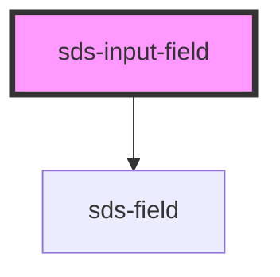

# sds-input-field

<!-- Auto Generated Below -->

## Overview

Input Field

## Properties

| Property      | Attribute     | Description                                   | Type                  | Default |
| ------------- | ------------- | --------------------------------------------- | --------------------- | ------- |
| `description` | `description` | A secondary label below the input             | `string \| undefined` | `''`    |
| `disabled`    | `disabled`    | Disables the input                            | `boolean`             | `false` |
| `error`       | `error`       | An error message that appears below the input | `string \| undefined` | `''`    |
| `label`       | `label`       | The input label                               | `string \| undefined` | `''`    |
| `placeholder` | `placeholder` | Placeholder text for the input                | `string \| undefined` | `''`    |
| `required`    | `required`    | Marks the input as required                   | `boolean`             | `false` |
| `type`        | `type`        | The type of input                             | `string \| undefined` | `''`    |

## Dependencies

### Depends on

- [sds-field](../SdsFieldset)

### Graph

----------------------------------------------

*Built with [StencilJS](https://stenciljs.com/)*
