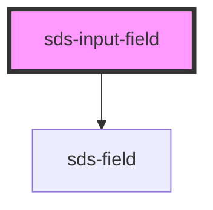

# sds-input-field

<!-- Auto Generated Below -->

## Overview

Input Field

## Properties

| Property       | Attribute       | Description                                   | Type      | Default |
| -------------- | --------------- | --------------------------------------------- | --------- | ------- |
| `defaultValue` | `default-value` | Sets the default value for the input          | `string`  | `''`    |
| `description`  | `description`   | A secondary label below the input             | `string`  | `''`    |
| `disabled`     | `disabled`      | Disables the input                            | `boolean` | `false` |
| `error`        | `error`         | An error message that appears below the input | `string`  | `''`    |
| `label`        | `label`         | The input label                               | `string`  | `''`    |
| `placeholder`  | `placeholder`   | Placeholder text for the input                | `string`  | `''`    |
| `required`     | `required`      | Marks the input as required                   | `boolean` | `false` |
| `type`         | `type`          | The type of input                             | `string`  | `''`    |

## Dependencies

### Depends on

- [sds-field](../SdsFieldset)

### Graph

----------------------------------------------

*Built with [StencilJS](https://stenciljs.com/)*
