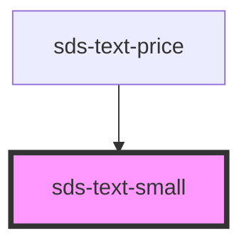

# sds-text-small

<!-- Auto Generated Below -->

## Properties

| Property      | Attribute      | Description             | Type                                                                                   | Default   |
| ------------- | -------------- | ----------------------- | -------------------------------------------------------------------------------------- | --------- |
| `elementType` | `element-type` | Element type            | `"h1" \| "h2" \| "h3" \| "h4" \| "h5" \| "h6" \| "p" \| "small" \| "span" \| "strong"` | `'small'` |
| `lineHeight`  | `line-height`  | Line height of the text | `"body" \| "single"`                                                                   | `'body'`  |

## Dependencies

### Used by

- [sds-text-price](../sds-text-price)

### Graph

---

_Built with [StencilJS](https://stenciljs.com/)_
