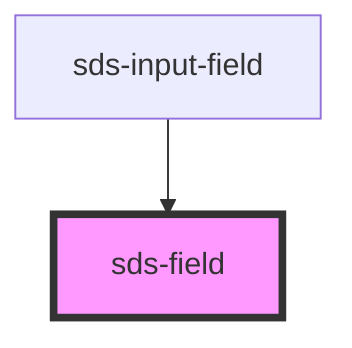

# sds-field

<!-- Auto Generated Below -->

## Overview

Fieldset Field

## Properties

| Property   | Attribute  | Description                              | Type      | Default |
| ---------- | ---------- | ---------------------------------------- | --------- | ------- |
| `disabled` | `disabled` | Controls if the field is disabled or not | `boolean` | `false` |

## Dependencies

### Used by

- [sds-input-field](../sds-input-field)

### Graph

---

_Built with [StencilJS](https://stenciljs.com/)_
