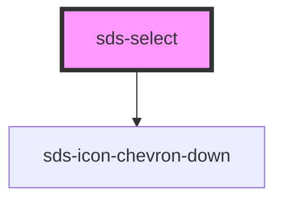

# sds-select

<!-- Auto Generated Below -->

## Overview

Select

## Properties

| Property      | Attribute     | Description                    | Type      | Default |
| ------------- | ------------- | ------------------------------ | --------- | ------- |
| `disabled`    | `disabled`    | Disables the input             | `boolean` | `false` |
| `placeholder` | `placeholder` | Placeholder text for the input | `string`  | `''`    |

## Dependencies

### Depends on

- [sds-icon-chevron-down](../../icons)

### Graph

---

_Built with [StencilJS](https://stenciljs.com/)_
